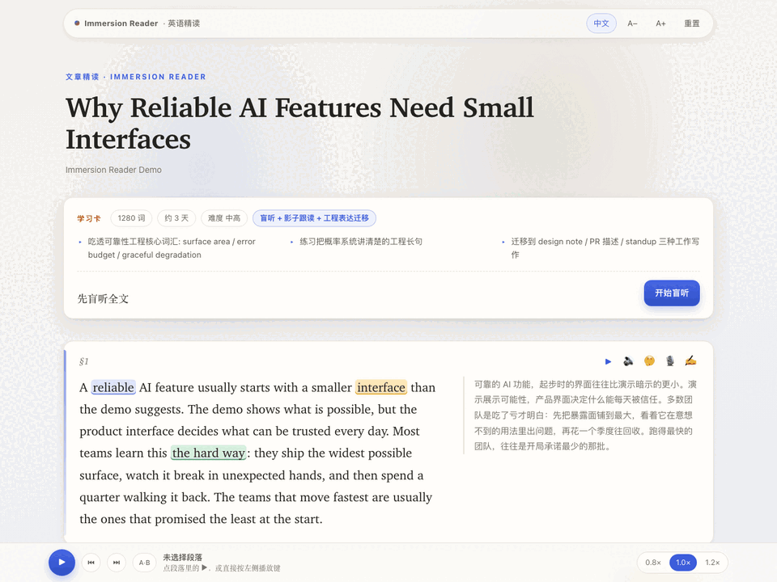

# 英语沉浸阅读 (Immersion Reader)

把英文长文或逐字稿编译成本地静态精读页。

[English](README.md) | [简体中文](README.zh.md)

[](LICENSE)
[](docs/demo/index.html)



## 这是什么

- 面向本地已安装 OpenCode / Codex / Claude Code 的开发者。
- 产物是可离线打开的 HTML5 学习页。
- 默认使用 Edge TTS 生成 mp3。
- 朗读逐词高亮，读到哪亮到哪；点任意单词即从该词播放。
- 页面内支持复制给本地 agent 问词、拆段、批改。

## 这不是什么

- 不是 App。
- 不是平台。
- 没有账号。
- 没有后端。
- 没有数据库。
- 公开版不包含本地 agent CLI bridge。

页面只提供复制 prompt。需要问词、拆段、批改或迁移输出时，复制后粘给你自己的本地 agent。

## 划词卡策略

- 单词划选可以显示离线词典卡。
- 2-5 词词组保持 agent 卡；词组整体义经常不等于逐词义相加。
- 更长选段复制精读 prompt，交给本地 agent 拆解。
- 点击预设 chunk 是另一条路径：人工写好的 chunk 仍可显示中文含义和例句。

## 先体验再安装

编译好的示例课在 [`docs/demo/index.html`](docs/demo/index.html)——clone 后浏览器直接打开即可，无需安装。

同一页面已通过 GitHub Pages 在线提供：<https://rayw-lab.github.io/immersion-reader/demo/>。

## 快速开始

```bash
python3.13 -m venv .venv  # 或任意 Python >= 3.10
. .venv/bin/activate
python -m pip install --upgrade pip
python -m pip install -e '.[dev]'
python src/build_page.py examples/demo/segments.json --out lessons/demo
python src/tts_generate.py examples/demo/segments.json --out lessons/demo/audio --dry-run
python3 -m http.server 8770 --directory lessons/demo
```

然后打开 `http://localhost:8770/index.html`。

生成课默认放在 `lessons/`，该目录已被 git 忽略。用户自己抓取的 transcript、私有文章和生成音频不要入仓，除非你拥有发布权。

## Skill 安装

把 `skills/immersion-reader/` 复制到 `~/.claude/skills/` 或项目 `.claude/skills/`。OpenCode 和 Codex 用户保留本仓库的 `AGENTS.md`，让 agent 按数据契约生成课程。

## 验证

```bash
python -m pytest -q
python -m playwright install chromium
python -m pytest tests/verify_browser.py tests/verify_ui_controls.py -q
```

## 录音隐私

跟读录音只在当前页面内存里存在。不会上传, 不会写入磁盘。关闭页面后录音消失。

## License

MIT。见 [`LICENSE`](LICENSE)。
